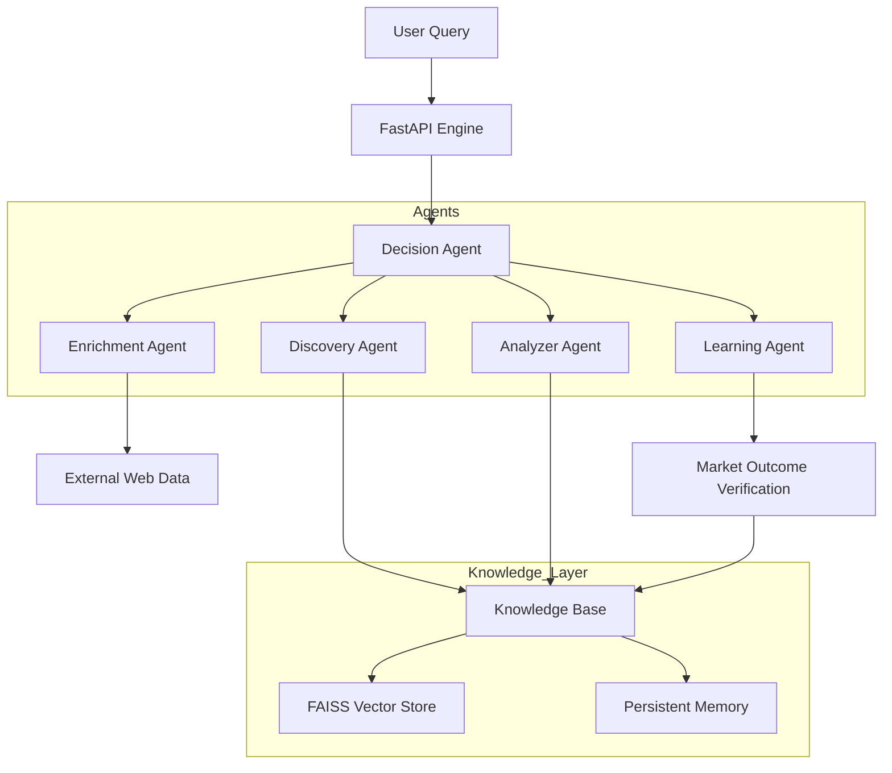

# Prediction Market Intelligence Engine

A production-grade, multi-agent intelligence system designed to discover, analyze, and rank top traders on **Polymarket** and **Kalshi**. Built with a RAG-based knowledge layer, advanced scoring algorithms, and a closed-loop learning mechanism.

---

## Introduction
Prediction markets are highly efficient but fragmented. Decoding the "alpha" from successful traders requires more than just looking at PnL—it requires analyzing consistency, niche expertise, and risk-adjusted returns. This project provides a professional suite of agents that automate this research, providing actionable, explainable trading intelligence.

## Problem Statement
Retail traders often follow "whales" based on raw profit alone, which leads to high-risk exposure and loss during market shifts. 
- **The Challenge**: Identifying *consistent* winners in specific niches (e.g., NBA vs. Politics).
- **The Gap**: Most bots lack "memory" and don't learn from prior market outcomes.
- **The Solution**: An agentic system that ranks traders by multifaceted metrics and uses RAG (Retrieval Augmented Generation) to verify past performance against real-world sentiment.

## 🏗️ Methodology: The Multi-Agent Intelligence Flow

The system operates as a collaborative "think-tank" of specialized AI agents, each handling a critical part of the intelligence pipeline:

### 1. Discovery Layer (Agentic Fallback Strategy)
*   **Role**: These agents act as the "scouts."
*   **Primary**: Scrapes real-time leaderboards using Apify actors.
*   **Agentic Fallback**: If a scraper is blocked or outdated, the system automatically switches to **Google Search + LLM Extraction** to find top traders, ensuring "alpha" is never lost.

### 2.  Quantitative Analysis (`AnalyzerAgent`)
*   **Role**: The "Math Expert."
*   **Operation**: Processes raw trade data to compute ROI %, Win Rate, Consistency, and Risk-adjusted returns.

### 3.  Real-Time Enrichment (`EnrichmentAgent`)
*   **Role**: The "Context Researcher."
*   **Operation**: Performs a live Google Search for the latest news/rumors (e.g., "NBA stars resting today") to contextualize the trade advice.

### 4.  Synthesis & Decision (`DecisionAgent`)
*   **Role**: The "Portfolio Manager" (The Brain).
*   **Operation**: Synthesizes all data into a structured **JSON Intelligence Report**. It uses **Dynamic Model Routing** to select the best available free LLM on OpenRouter.

### 5.  Closed-Loop Learning (`LearningAgent`)
*   **Role**: The "Quality Control" (Self-Improvement).
*   **Operation**: Uses **Hermes Reflection** to compare predictions vs. actual outcomes, saving successful patterns as persistent "Skills."

##  System Architecture


##  How to Run

### 1. Prerequisites
- Python 3.11+
- [Apify API Token](https://apify.com/) (For market scraping)
- [OpenRouter API Key](https://openrouter.ai/) (For LLM Intelligence)

### 2. Setup
```bash
# Clone the repository
# (Assuming you are in the project directory)

# Install dependencies
pip install -r requirements.txt
```

### 3. Configuration
Create a `.env` file in the root directory:
```env
APIFY_API_TOKEN=your_token
OPENROUTER_API_KEY=your_key
OPENROUTER_MODEL=meta-llama/llama-3-8b-instruct:free
MOCK_MODE=true  # Set to false to use real API data
```

### 4. Start the Intelligence Engine
```bash
# Start the API and Dashboard
python -m api.routes
```
- **Dashboard**: The UI will automatically open at [http://127.0.0.1:8001/docs](http://127.0.0.1:8001/docs)
- **Direct CLI Run**: `python main_v2.py "Your Query"`

##  Key Features
- **Structured Intelligence**: Returns ranked lists of traders with confidence scores.
- **Backtesting**: Simulate "what if" scenarios for any wallet.
- **Auto-UI**: Launches browser dashboard automatically on server start.
- **RAG-Powered**: Uses FAISS embeddings for high-speed profile matching.

---
*Developed as a high-impact, multi-agent AI system for the future of decentralized prediction markets.*
