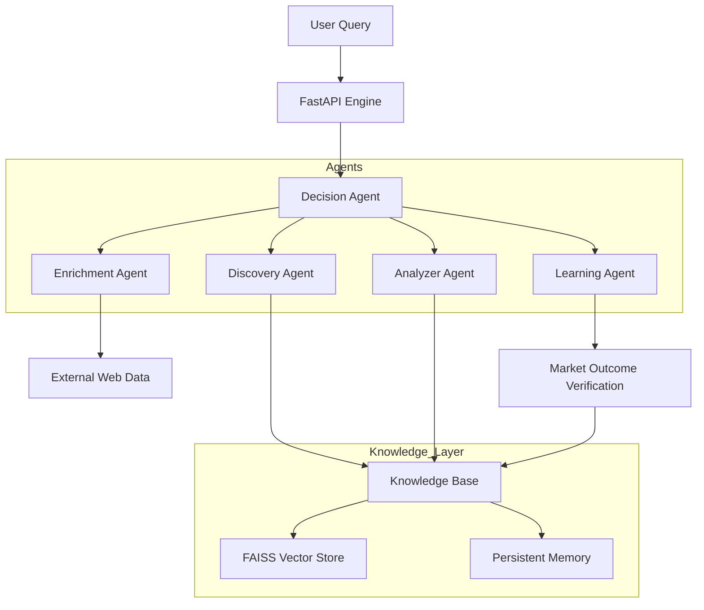

# 🧠 Prediction Market Intelligence Engine

A production-grade, multi-agent intelligence system designed to discover, analyze, and rank top traders on **Polymarket** and **Kalshi**. Built with a RAG-based knowledge layer, advanced scoring algorithms, and a closed-loop learning mechanism.

---

## 📌 Introduction
Prediction markets are highly efficient but fragmented. Decoding the "alpha" from successful traders requires more than just looking at PnL—it requires analyzing consistency, niche expertise, and risk-adjusted returns. This project provides a professional suite of agents that automate this research, providing actionable, explainable trading intelligence.

## ⚠️ Problem Statement
Retail traders often follow "whales" based on raw profit alone, which leads to high-risk exposure and loss during market shifts. 
- **The Challenge**: Identifying *consistent* winners in specific niches (e.g., NBA vs. Politics).
- **The Gap**: Most bots lack "memory" and don't learn from prior market outcomes.
- **The Solution**: An agentic system that ranks traders by multifaceted metrics and uses RAG (Retrieval Augmented Generation) to verify past performance against real-world sentiment.

## 🛠 Methodology
The system follows a **Modular Intelligence** approach:
1. **Discovery**: Scraping leaderboard data from Polymarket and Kalshi via Apify.
2. **Analysis**: Calculating ROI, risk scores, and streak consistency per wallet.
3. **Niche Mapping**: LLM-based classification of trader expertise based on historical trade titles.
4. **Enrichment**: Web scraping real-time news to provide market context for current events.
5. **Decision**: A RAG-based ensemble that retrieves the most similar "winning profiles" for a given user query.
6. **Learning**: A feedback loop that verifies market outcomes and updates trader reliability scores in a persistent FAISS vector store.

## 🏗 System Architecture


## 🚀 How to Run

### 1. Prerequisites
- Python 3.11+
- [Apify API Token](https://apify.com/) (For market scraping)
- [OpenRouter API Key](https://openrouter.ai/) (For LLM Intelligence)

### 2. Setup
```bash
# Clone the repository
# (Assuming you are in the project directory)

# Install dependencies
pip install -r requirements.txt
```

### 3. Configuration
Create a `.env` file in the root directory:
```env
APIFY_API_TOKEN=your_token
OPENROUTER_API_KEY=your_key
OPENROUTER_MODEL=meta-llama/llama-3-8b-instruct:free
MOCK_MODE=true  # Set to false to use real API data
```

### 4. Start the Intelligence Engine
```bash
# Start the API and Dashboard
python -m uvicorn api.routes:app --reload
```
- **Dashboard**: The UI will automatically open at [http://127.0.0.1:8000/docs](http://127.0.0.1:8000/docs)
- **Direct CLI Run**: `python main_v2.py "Your Query"`

## 💎 Key Features
- **Structured Intelligence**: Returns ranked lists of traders with confidence scores.
- **Backtesting**: Simulate "what if" scenarios for any wallet.
- **Auto-UI**: Launches browser dashboard automatically on server start.
- **RAG-Powered**: Uses FAISS embeddings for high-speed profile matching.

---
*Developed as a high-impact, multi-agent AI system for the future of decentralized prediction markets.*
